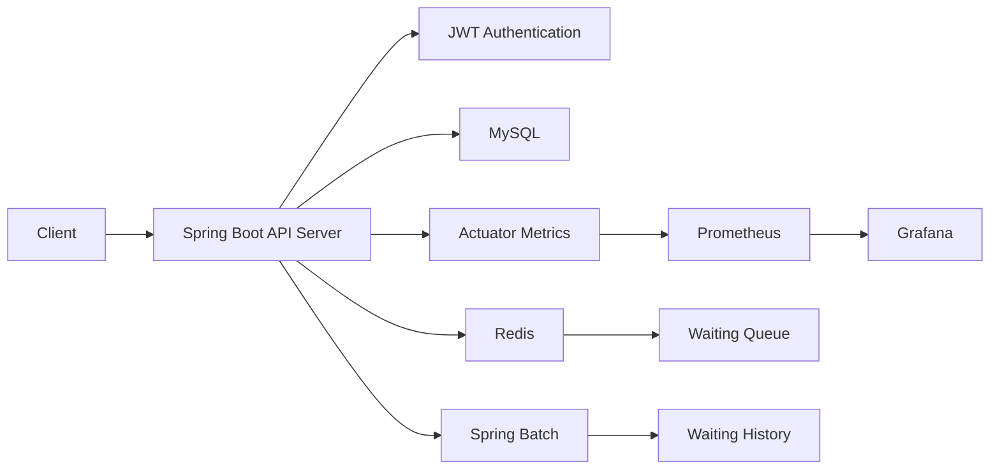
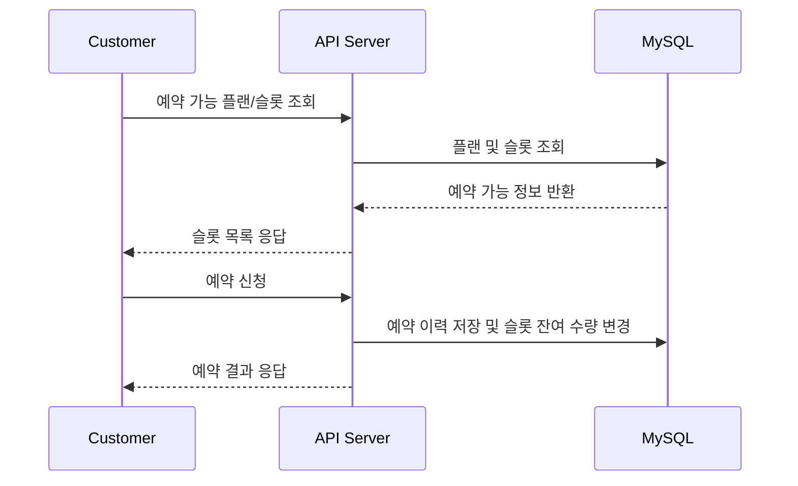
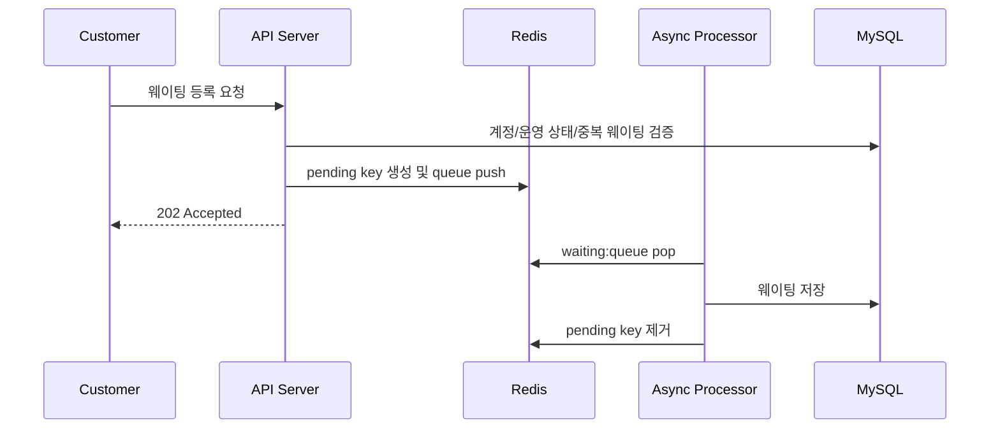

# The Last Supper

식당의 예약과 현장 웨이팅을 함께 관리하는 백엔드 서비스입니다.

예약 슬롯 생성, 고객 예약, 웨이팅 접수, 대기 순번 조회, 웨이팅 호출, 운영 상태 관리까지 매장 운영 흐름을 하나의 API 서버에서 처리하도록 설계했습니다.

## 프로젝트 소개

The Last Supper는 식당 이용자가 예약 또는 웨이팅을 통해 매장 방문을 신청하고, 매장 운영자가 예약 슬롯과 웨이팅 큐를 관리할 수 있는 백엔드 프로젝트입니다.

단순 CRUD를 넘어, 실제 매장 운영에서 발생할 수 있는 대기열 증가, 중복 접수, 대기번호 발급, 영업 종료 후 이력 관리 같은 문제를 다루는 데 초점을 맞췄습니다.

## 주요 기능

### 회원 및 인증

- 회원가입, 로그인, JWT 기반 인증
- access token 재발급
- 회원 정보 조회 및 수정
- 비밀번호 변경

### 매장 관리

- 매장 등록, 조회, 수정
- 매장별 예약/웨이팅 운영 정보 관리

### 예약 관리

- 예약 플랜 조회
- 예약 슬롯 오픈
- 예약 슬롯 상태 변경
- 고객 예약 등록
- 예약 취소 및 거절
- 내 예약 목록 조회

### 웨이팅 관리

- 웨이팅 오픈, 중단, 종료
- 고객 웨이팅 등록
- 웨이팅 취소 및 미루기
- 내 대기 순번 조회
- 다음 고객 호출
- 웨이팅 큐 조회

### 운영 및 모니터링

- Redis 기반 웨이팅 큐 처리
- 웨이팅 실패 요청 dead-letter 큐 관리
- 웨이팅 이력 배치 처리
- Prometheus/Grafana 기반 모니터링

## 기술 스택

| 영역 | 기술 |
| --- | --- |
| Language | Java 17 |
| Framework | Spring Boot 3.4.4 |
| Web | Spring Web, Validation |
| Security | Spring Security, JWT |
| Database | MySQL, H2 |
| ORM | Spring Data JPA, Hibernate |
| Cache/Queue | Redis |
| Batch | Spring Batch |
| Realtime | WebSocket |
| Monitoring | Actuator, Prometheus, Grafana |
| Build | Gradle |
| Test | JUnit 5, Mockito |

## 시스템 구조



## 도메인 흐름

### 예약 흐름



### 웨이팅 등록 흐름



## 문제 해결 경험

### 1. 웨이팅 등록 응답 속도 개선

웨이팅 등록 요청이 몰릴 경우 DB 저장 로직이 API 응답 시간을 지연시킬 수 있다고 판단했습니다. 이를 줄이기 위해 고객 요청은 Redis 큐에 먼저 적재하고, 별도 비동기 프로세서가 큐를 소비해 DB에 저장하도록 개선했습니다.

개선 후 API는 요청 접수 시점에 빠르게 `202 Accepted`를 반환하고, 실제 저장 작업은 백그라운드에서 순차 처리됩니다.

### 2. 중복 웨이팅 접수 방지

비동기 큐 구조에서는 같은 사용자가 짧은 시간 안에 여러 번 요청할 경우 DB 저장 전까지 중복 요청이 들어갈 수 있습니다. 이를 막기 위해 `waiting:pending:{accountId}` Redis key를 사용했습니다.

pending key는 Redis `SETNX` 계열의 원자적 연산인 `setIfAbsent`로 생성합니다. 여러 요청이 동시에 들어와도 하나의 요청만 pending key를 획득하고, 나머지는 중복 요청으로 판단해 접수를 거부합니다. 큐 처리 성공 또는 실패 후에는 pending key를 제거해 다음 요청이 가능하도록 했습니다.

### 3. 원자적 대기번호 발급

웨이팅 대기번호는 동시에 여러 고객이 등록하더라도 중복 없이 발급되어야 합니다. 이를 위해 Redis의 `INCR` 연산으로 `waiting:number` 값을 증가시키도록 구성했습니다.

`INCR`은 Redis 단일 명령으로 원자적으로 처리되기 때문에, 여러 요청이 동시에 대기번호를 발급받아도 같은 번호가 중복 발급되지 않습니다.

### 4. 실패 요청 유실 방지

Redis list에서 payload를 pop한 뒤 DB 저장 중 예외가 발생하면 요청이 사라질 수 있습니다. 이를 보완하기 위해 처리 실패 payload를 `waiting:queue:dead-letter`에 저장하도록 했습니다.

이 구조를 통해 운영 중 실패한 웨이팅 요청을 추적하고 재처리할 수 있는 기반을 마련했습니다.

### 5. 운영 중 대기번호 초기화 문제 개선

초기 구현에서는 애플리케이션 시작 시 `waiting:number`를 항상 `0`으로 초기화했습니다. 서버가 영업 중 재시작되면 기존 대기번호와 충돌할 수 있는 위험이 있었습니다.

이를 개선해 기본적으로 앱 시작 시 대기번호를 초기화하지 않도록 변경했고, 필요한 경우에만 명시 설정으로 초기화할 수 있게 했습니다.

### 6. API 보안 범위 정리

초기 보안 설정에서는 `/api/v1/**` 전체가 공개되어 JWT 인증이 사실상 적용되지 않는 문제가 있었습니다. 회원가입, 로그인, 토큰 재발급, Swagger, Actuator 일부 경로만 공개하고 나머지 API는 인증이 필요하도록 보안 범위를 조정했습니다.

## 테스트

핵심 웨이팅 큐 로직은 단위 테스트로 검증했습니다.

- 웨이팅 등록 전 검증 순서
- 중복 pending key 존재 시 예외 처리
- Redis `setIfAbsent` 기반 중복 접수 방지
- Redis `INCR` 기반 대기번호 발급
- Redis 큐 적재 실패 시 pending key 해제
- 정상 payload 처리 시 DB 저장 요청 생성
- 검증 실패 payload의 dead-letter 큐 이동
- 잘못된 payload의 dead-letter 큐 이동

```bash
JAVA_HOME=/Library/Java/JavaVirtualMachines/temurin-17.jdk/Contents/Home ./gradlew test
```

## 주요 API

| 분류 | Method | Endpoint | 설명 |
| --- | --- | --- | --- |
| Auth | POST | `/api/v1/signup` | 회원가입 |
| Auth | POST | `/api/v1/login` | 로그인 |
| Auth | POST | `/api/v1/refresh` | 토큰 재발급 |
| Account | GET | `/api/v1/customers` | 내 정보 조회 |
| Restaurant | POST | `/api/v1/restaurants` | 매장 등록 |
| Restaurant | GET | `/api/v1/restaurants/{restaurantId}` | 매장 조회 |
| Reservation | POST | `/api/v1/reservation` | 예약 등록 |
| Reservation | GET | `/api/v1/reservation/me` | 내 예약 조회 |
| Slot | POST | `/api/v1/reservations/restaurants/{restaurantId}/slots/open` | 예약 슬롯 오픈 |
| Waiting | POST | `/api/v1/waiting` | 웨이팅 등록 |
| Waiting | GET | `/api/v1/waiting/position` | 내 대기 순번 조회 |
| Waiting | POST | `/api/v1/waitings/open` | 웨이팅 오픈 |
| Waiting | POST | `/api/v1/waitings/close` | 웨이팅 종료 |

## 로컬 실행

### 1. 인프라 실행

```bash
docker compose up -d mysql redis prometheus grafana
```

기본 포트:

- API Server: `8080`
- MySQL: `3307`
- Redis: `6379`
- Prometheus: `9090`
- Grafana: `3000`

### 2. `.env` 설정

```properties
DB_URL=jdbc:mysql://localhost:3307/the_last_supper
DB_USERNAME=supper_user
DB_PASSWORD=supper_pass
DB_DRIVER=com.mysql.cj.jdbc.Driver

REDIS_HOST=localhost
REDIS_PORT=6379

SQL_INIT_MODE=always
JPA_DDL_AUTO=create
JPA_DDI=true

SECRET_KEY=replace-with-a-long-local-secret-key-at-least-32-bytes
SPRING_PROFILES_ACTIVE=dev
```

### 3. 애플리케이션 실행

```bash
JAVA_HOME=/Library/Java/JavaVirtualMachines/temurin-17.jdk/Contents/Home \
./gradlew bootRun --args='--spring.profiles.active=dev'
```

Swagger UI:

```text
http://localhost:8080/swagger-ui/index.html
```

Actuator:

```text
http://localhost:8080/actuator/health
http://localhost:8080/actuator/prometheus
```

## 트러블슈팅

### MySQL 3306 포트가 이미 사용 중인 경우

현재 Docker Compose는 MySQL을 호스트 `3307` 포트로 노출합니다. `.env`의 `DB_URL`도 `3307`로 맞춰야 합니다.

```properties
DB_URL=jdbc:mysql://localhost:3307/the_last_supper
```

### JWT 설정 오류가 나는 경우

`SECRET_KEY`가 누락되었거나 `dev` 프로필이 적용되지 않은 상태일 수 있습니다. `.env`와 실행 인자를 확인합니다.

```bash
./gradlew bootRun --args='--spring.profiles.active=dev'
```

### JDK 버전 문제

프로젝트 기준은 Java 17입니다. 로컬 기본 Java가 21 이상이면 `JAVA_HOME`을 JDK 17로 지정해 실행합니다.

## 성과 요약

- 예약과 웨이팅을 함께 관리하는 식당 운영 백엔드 구현
- Redis 큐 기반 웨이팅 등록 처리 구조 설계
- Redis `SETNX` 계열 pending key로 중복 웨이팅 접수 방지
- Redis `INCR` 기반 원자적 대기번호 발급
- dead-letter 큐로 실패 요청 추적 가능성 확보
- JWT 인증 범위 정리로 API 보안 개선
- Prometheus/Grafana 기반 모니터링 환경 구성
- 웨이팅 핵심 로직 단위 테스트 보강
